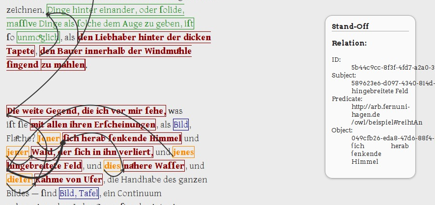

# standoff-viz -- Visualizing standoff annotations and relations in a browser #

Status: broken

`standoff-viz` comes with some scripts that make it easy to display
assertive standoff annotations in a browser. The scripts are designed
for working with TEI P5 as source files and make use of [TEI
Boilerplate](https://github.com/GrantLS/TEI-Boilerplate) for rendering
in TEI XML in your browser. The following scripts have to copied to
the `dist/contents` directory of your clone of `TEI Boilerplate`:

- `svg4tei.xsl`: xslt stylesheet that imports (includes) `TEI
  Boilerplate`, but overrides the template responsible for generating
  the `body` element of the resulting html. It inserts a root element
  for scalable vector graphics, loads
  [`jQuery`](https://jquery.com/) and javascript for drawing relations
  between annotated text spans.

- `svgannot.js`: javascript library for drawing relations.

You should also put `standoff.css` into the `dist/css` directory of
your clone of `TEI Boilerplate`. Note: There are also `canvas4tei.xsl`
and `canvasannot.js`, which were an earlier try doing the
visualisation based on the `html5` element `canvas`. 

To generate internalized markup run `standoff internalize` like this
and copy it's output into the `contents` directory of your boilerplate
clone, too:

```{shell}
standoff internalize -i "<?xml-stylesheet type=\"text/xsl\"	href=\"svg4tei.xsl\"?>" --standoff-json JSON-FILE SOURCE-FILE > OUTPUT
```

This not only internalizes the external markup but also inserts a
processing instruction into the resulting XML, so that the graphical
elements representing semantic relations will automagically be
inserted into the nice boilerplate representation of the annotated TEI
source.

As a second step you have to generate a JSON file containing the
relations:

```{shell}
standoff dumped -j -l DUMP-FILE > relations.json  ## broken! FIXME
```


The resulting `relations.json` have to be present in the `contents`
directory, too. If you have a `custom.css` like explained in the docs
of TEI Boilerplate, your annotations get colored and semantic
relations may look like in the screenshot below. When you move your
mouse over a relation, you will see details in the info box on the
right: 

Below is a tree of directories and files of your local checkout of
TEI-Boilerplate and the additional files described above. `herder.xml`
is the file generated with the `standoff internalize ...` like
above. Open this file with firefox or an other browser, that is able
to interpret the `xsl-stylesheet` processing instruction.

	TEI-Boilerplate
	+-- ...
	+-- dist
	|   +-- content
	|   |   +-- ...
	|   |   +-- herder.xml  <--- generated with $ standoff internalize ...
	|   |   +-- relations.json  <--- generated with $ standoff dumped ...
	|   |   +-- svg4tei.xsl  <--- xsl stylesheet
	|   |   +-- svgannot.js  <--- javascript for relations
	|   |   +-- teibpstyles.xml
	|   |   +-- teibp.xml
	|   |   +-- teibp.xsl
	|   |   \-- xml-to-string.xsl
	|   +-- css
	|   |   +-- custom.css  <--- your css
	|   |   +-- sleepy.css
	|   |   +-- standoff.css  <--- general css for standoff info box etc.
	|   |   +-- teibp.css
	|   |   \-- terminal.css
	|   +-- images
	|   |   \-- ...
	|   +-- index.html
	|   \-- js
	|       \-- ...
	\-- src
		+-- ...
		...

